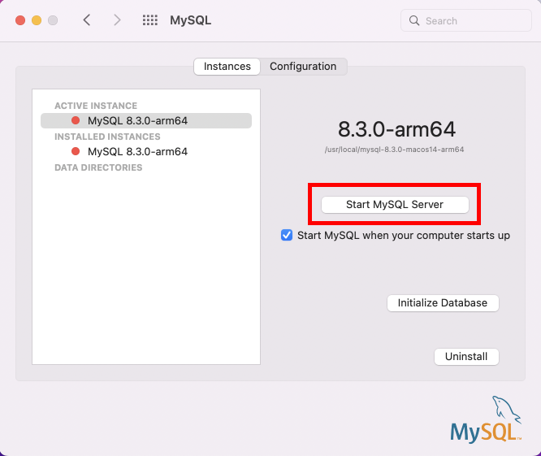
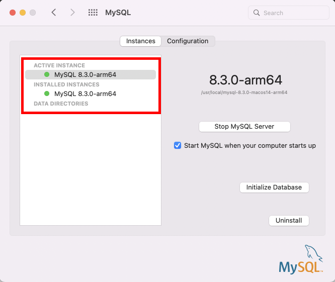

===================
Mac
===================

This section describes how to install MatD\ :sup:`3` and the requirements which have to be met, to be able to properly install and run the program on a system with MacOS.

**Prerequisites** 

Before we begin installation for the database, we must note the following prerequisites for a smooth installation. If you believe you have these, verify with the commands that verify this Add link.

1. Install *brew* to your system 

.. code:: bash

    /bin/bash -c "$(curl -fsSL https://raw.githubusercontent.com/Homebrew/install/HEAD/install.sh)"

2. To procure *pip*, simply install *python* via brew to your system as shown bellow

.. code:: bash

    brew install python

If the above command threw errors, try installing python3 instead: 

.. code:: bash

    brew install python3

If the above line successfully installed python3, please use *pip3* and *python3* wherever *pip* and *python* are mentioned in the future steps. 

**Package Installation** 

- Navigate to your desired directory and clone the project via github

.. code:: bash

    git clone https://github.com/HybriD3-database/MatD3.git

- Change directory into the main starter file directory

.. code:: bash 

    cd MatD3

- Create a python virtual environment using the following commands 

.. code:: bash 

    python -m venv venv
    source venv/bin/activate

- Run the following command to install all the required packages. (Remember to use *pip3* instead of *pip* if you installed python3) 

.. code:: bash 

    pip install -vr requirements.txt

(I Made fixes to the source code for requirements)

- Install mysql from their website. (Provision to show step by step installation)

.. code:: bash

    https://dev.mysql.com/downloads/mysql/

- After installing the service pane from the link above, click on 'Start MySQL Server'

- You will be prompted to enter a password. Please save the password you enter. After entering this, your server must now be active as shown bellow. 

- Now, go back to the terminal and create a database in the server you just created.

.. code:: bash

    mysql -u root -p 

- You will be prompted for the password. Enter the password you had created in the previous steps. Once you're in the mysql command line, create a database

.. code:: bash 

    create database materials;
    exit

- Navigate to settings.py using your text editor in the following path: 

.. code:: bash 
    
    /MatD3/mainproject/settings.py 

- Go to line 95 and add set default = 'root'

.. code:: bash

    'USER': config('DB_USER', default='root')

- Go to line 96 and set your default = <your password>

.. code:: bash 

    'PASSWORD': config('DB_PASSWORD', default='your password'),

- Go back to the terminal and run the static collection and migration commands 

.. code:: bash

    ./manage.py collectstatic
    ./manage.py migrate
     
- Congratulations! You've successfully configured the starter files and are ready to develop. Run the webapp server: 

.. code:: bash 

    ./manage.py runserver

- Go to your browser and head to the following URL to view the running server: 

.. code:: bash 

    http://127.0.0.1:8000/

